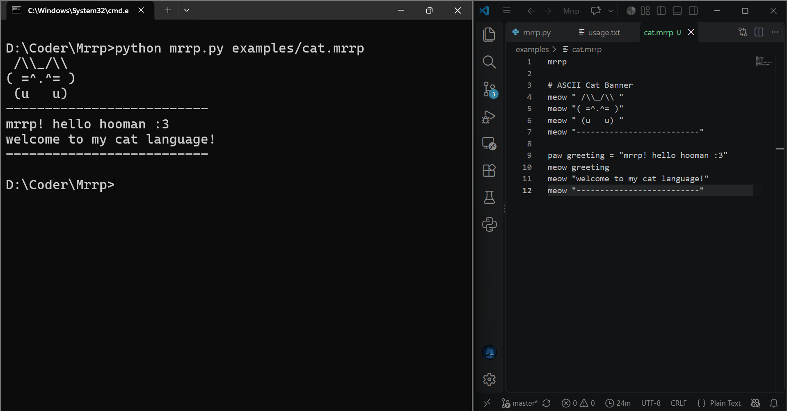

# Mrrp - my cat language :3

*Hey! so i made a tiny programming language called Mrrp.*
*its all about cats. it nerver yells at you and it can*
*remember future. yeah , really.*

# *To run it :* 

```
python mrrp.py examples/hello.mrrp
python mrrp.py 
```
(*This is for running it from source, you need to clone the repo first for this method*)

(*If you want to install the language on you computer just grab the executable from release section, it runs without python yay!!*)

# *Screenshot :*


(*This is Mrrp in terminal yeah its first mrrp program created in this world yay!!*)


# *Usage*

(*For usage guide see [usage guide](usage.txt)*)
(*It covers all you need to know about the Mrrp to make your first caty program using it.*) 

(*I left some examples in /examples, go try them!! mrrrrrrp* )

# *New in v0.2.0!*
(*The new version for Mrrp "v0.2.0" is released as of 2 oct 2026. enjoy!!)
- *New "adopt" and "borrow" features (see [usage guide](usage.txt) for more info.)*
- *Stablized some functions*

-------------------------------------------------------------------------------------------------------------------
*Built with lots of purrs , tuna for [hackclub ysws](https://crescent.hackclub.com/) :3.*

